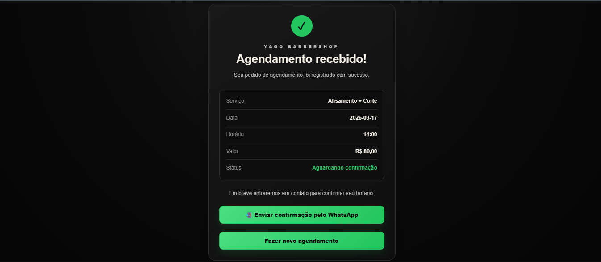
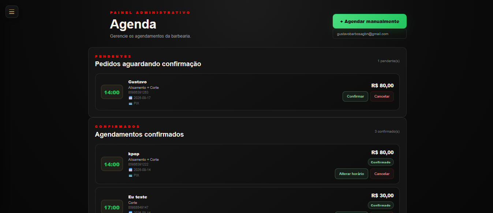
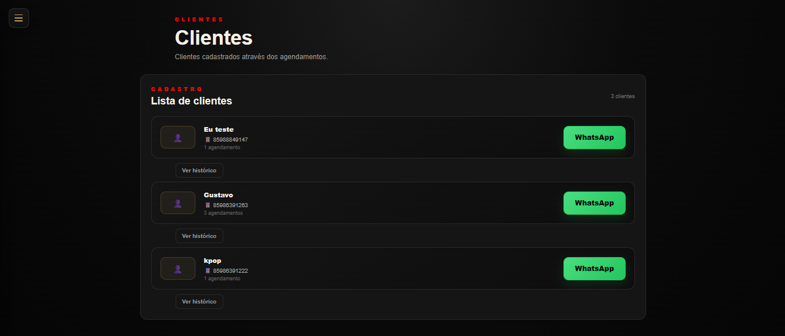

# Yago Barbershop 💈

Sistema de agendamento e gerenciamento desenvolvido para uma barbearia.

O projeto permite que os clientes realizem seus agendamentos online e que o barbeiro tenha uma área administrativa para acompanhar a agenda, clientes, serviços e financeiro.

🌐 **Aplicação:** https://saasbarber.onrender.com/

---

## Sobre o projeto

O Yago Barbershop foi desenvolvido para facilitar a rotina de uma barbearia que fazia boa parte do controle de horários e atendimentos de forma manual.

A aplicação foi criada pensando em dois lados:

* **Cliente:** realizar o agendamento de forma simples pelo celular ou computador.
* **Barbeiro:** ter uma área para acompanhar e organizar os atendimentos.

Além da parte visual, o projeto possui banco de dados, autenticação, controle de acesso e integrações para deixar o sistema realmente utilizável.

---

## Telas do sistema

### Página principal

Página inicial da barbearia, onde o cliente encontra as informações e pode iniciar um agendamento.


### Agendamento

O cliente escolhe o serviço, data e horário disponível para realizar o agendamento.



### Versão mobile

O sistema foi desenvolvido para funcionar também em dispositivos móveis, facilitando o uso pelo cliente no dia a dia.


---

## Área administrativa

O barbeiro possui uma área administrativa protegida por login para gerenciar o funcionamento da barbearia.

### Dashboard

Visão geral dos principais dados e agendamentos.


### Agenda

Visualização dos horários e dos atendimentos agendados.



### Clientes

Gerenciamento dos clientes cadastrados no sistema.



### Serviços

Cadastro e gerenciamento dos serviços oferecidos pela barbearia, incluindo preço e duração.


### Horários

Controle dos horários disponíveis para atendimento.


### Painel financeiro

Acompanhamento do movimento financeiro dos atendimentos.


### Menu administrativo

Menu lateral utilizado para navegar pelas diferentes áreas do painel.


---

## Funcionalidades

### Para o cliente

* Agendamento online
* Escolha do serviço
* Visualização de preço e duração
* Seleção de data e horário
* Cadastro de nome e telefone
* Confirmação do agendamento
* Integração com WhatsApp
* Interface adaptada para dispositivos móveis

### Para o barbeiro

* Login administrativo
* Dashboard
* Agenda de atendimentos
* Gerenciamento de clientes
* Cadastro e edição de serviços
* Controle de preços
* Controle da duração dos serviços
* Configuração de horários
* Controle da agenda
* Painel financeiro

---

## Tecnologias

* **Next.js**
* **React**
* **TypeScript**
* **Supabase**
* **PostgreSQL**
* **Supabase Auth**
* **Row Level Security (RLS)**
* **Resend**
* **WhatsApp**
* **Render**

---

## Banco de dados

O projeto utiliza PostgreSQL através do Supabase.

O banco é responsável por armazenar informações como:

* Clientes
* Serviços
* Agendamentos
* Horários
* Configurações da barbearia

O acesso aos dados é controlado através de autenticação e Row Level Security (RLS).

A estrutura inicial do banco está disponível em:

```text
supabase/schema.sql
```

---

## Rodando localmente

Clone o repositório:

```bash
git clone https://github.com/gustavoguga18/yago-barbershop.git
```

Entre na pasta:

```bash
cd yago-barbershop
```

Instale as dependências:

```bash
npm install
```

Crie um arquivo `.env.local`:

```env
NEXT_PUBLIC_SUPABASE_URL=
NEXT_PUBLIC_SUPABASE_ANON_KEY=
```

Depois execute:

```bash
npm run dev
```

A aplicação ficará disponível em:

```text
http://localhost:3000
```

---

## Deploy

O projeto está publicado no Render e utiliza variáveis de ambiente para as configurações necessárias em produção.

---

## Próximos passos

O projeto continua em desenvolvimento e algumas ideias para futuras versões são:

* Evoluir a experiência como PWA
* Melhorar a experiência mobile
* Adicionar novas opções de notificações
* Evoluir os relatórios financeiros
* Facilitar ainda mais a adaptação para outros estabelecimentos

---

## Autor

**Gustavo Barbosa**

Projeto desenvolvido para colocar em prática conhecimentos de desenvolvimento web full-stack, banco de dados, autenticação, APIs e deploy.

[GitHub](https://github.com/gustavoguga18)
